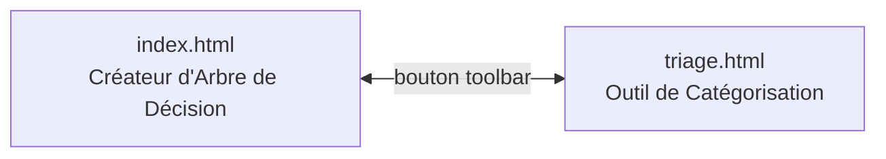
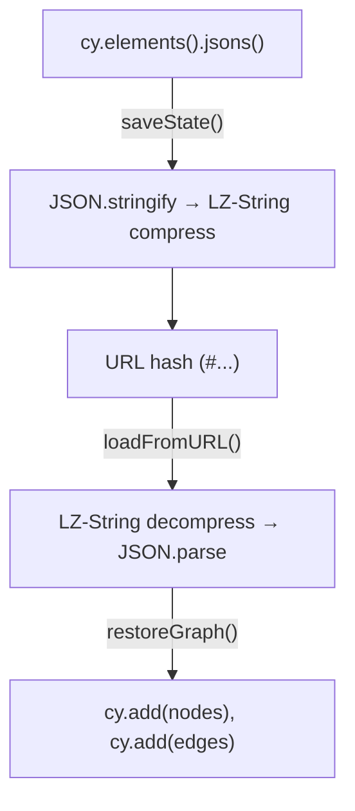

# ESTIME-IA-Arbre-de-decision

Activité éducative à deux volets : un **créateur d'arbre de décision** (Cytoscape.js) et un **outil de catégorisation** par drag & drop. Les deux pages sont liées et se naviguent mutuellement.

> **Stack :** HTML + CSS + Vanilla JS — aucun bundler, aucun framework.  
> **Libs externes :** [Cytoscape.js](https://js.cytoscape.org/) (graphes), [LZ-String](https://pieroxy.net/blog/pages/lz-string/index.html) (compression URL).  
> **Déploiement :** GitHub Pages (`.github/workflows/static.yml`).


---

## Navigation



---

## Structure des fichiers

```
index.html       ← Éditeur d'arbre (Cytoscape.js) — nœuds décision/résultat, liens, renommage
triage.html      ← Catégorisation — jetons numérotés à glisser dans des catégories colorées
.github/workflows/static.yml  ← Déploiement GitHub Pages
```

---

## index.html — Créateur d'Arbre de Décision

### Fonctionnalités

| Action | Comment |
|---|---|
| Ajouter un nœud décision | Clic sur le **losange vert** dans la toolbar |
| Ajouter un nœud résultat | Clic sur le **rectangle bleu** dans la toolbar |
| Relier deux nœuds | **Clic droit + glisser** d'un nœud à l'autre |
| Renommer un nœud ou une arête | **Double-clic** dessus |
| Supprimer un nœud | **Glisser** le nœud sur l'icône poubelle (bas-droite) |
| Afficher l'aide | Clic sur le bouton **?** (haut-droite) |

### Persistance

L'état du graphe est sérialisé dans le **hash de l'URL** via LZ-String :



- Chaque modification (ajout nœud, ajout lien, renommage, drag) appelle `saveState()` → `history.pushState()`
- **Undo/Redo** fonctionne avec les boutons du navigateur (popstate → `restoreGraph`)
- L'URL est partageable : copier-coller l'URL envoie le graphe exact

### Nœuds Cytoscape

| Classe | Forme | Couleur | Usage |
|---|---|---|---|
| `.decision` | Diamant | `#4CAF50` (vert) | Nœud de décision (question) |
| `.leaf` | Rectangle arrondi | `#2196F3` (bleu) | Nœud résultat (feuille) |

### Arêtes

- Première arête sortante d'un nœud → label `"oui"` automatique
- Deuxième arête → label `"non"` automatique
- Arêtes suivantes → pas de label

---

## triage.html — Outil de Catégorisation

### Fonctionnalités

| Action | Comment |
|---|---|
| Ajouter une catégorie | Bouton **+ Catégorie** |
| Ajouter un élément (jeton) | Bouton **+ Élément** |
| Classer un élément | **Glisser-déposer** le jeton dans une catégorie |
| Renommer une catégorie | **Double-clic** sur le titre |
| Supprimer une catégorie | Bouton **✖** (les jetons retournent dans « Non attribués ») |
| Réinitialiser | Bouton **↻** |

### Persistance

Même mécanisme que index.html : état sérialisé dans le hash URL via LZ-String. Undo/redo via popstate.

### État interne

```js
state = {
  categories: [{ id: 'cat...', name: 'Catégorie', color: '#FFCDD2' }, ...],
  tokens: { '1': 'unassigned', '2': 'cat123456', ... }  // token_id → category_id
}
```

### Couleurs des catégories

Palette cyclique (6 couleurs) : `#FFCDD2`, `#C8E6C9`, `#BBDEFB`, `#FFE0B2`, `#D1C4E9`, `#FFECB3`

---

## Guide rapide pour modifier

### Changer les types de nœuds (index.html)

Les styles Cytoscape sont définis dans le tableau `style: [...]` (~ligne 110). Pour ajouter un nouveau type :
1. Ajouter un sélecteur `.montype` avec la forme et couleur voulues
2. Ajouter un bouton dans le `#toolbar` HTML
3. Ajouter le handler `onclick` → `addNode('montype')`

### Changer le label automatique des arêtes (index.html)

Logique dans le handler `cxttapend` (~ligne 353) :
```js
const lbl = cnt===0 ? 'oui' : cnt===1 ? 'non' : '';
```
Modifier cette logique pour changer les labels par défaut.

### Changer la palette de couleurs des catégories (triage.html)

Modifier le tableau `colors` (~ligne 85) :
```js
const colors = ['#FFCDD2','#C8E6C9','#BBDEFB','#FFE0B2','#D1C4E9','#FFECB3'];
```

### Changer l'apparence des jetons (triage.html)

Modifier la classe `.token` dans le CSS (~ligne 43) — actuellement des cercles de 48×48px en `#4db6ac`.

### Modifier la persistance

Les deux pages utilisent le même pattern :
- `updateURL(data)` → `LZString.compressToEncodedURIComponent()` → `history.pushState()`
- `loadFromURL()` / `loadState()` → `LZString.decompressFromEncodedURIComponent()`

Pour switcher vers `localStorage` au lieu du hash URL, remplacer ces deux fonctions dans chaque page.

### Modifier les styles

CSS inline dans chaque fichier. Variables notables :
- **index.html** — toolbar grise `#f4f4f4`, fond blanc
- **triage.html** — toolbar noire `#000`, fond `#f0f0f0`